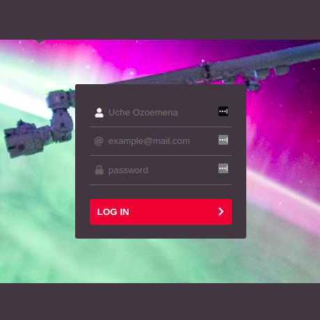
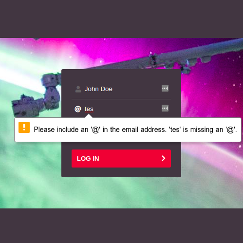
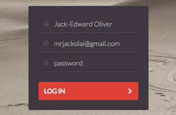

# Sign Up Form

Live demo available [here](http://35.156.16.36).

This is a sign up form built with React, Redux, and redux-form, and styled using
SASS. It is my recreation of challenge 001 of the
[React Daily UI challenge](https://github.com/fullstackreact/react-daily-ui) by
Fullstack React.

|                Empty Form                |                  Form Validation                   |         Original (Fullstack React)         |
| :--------------------------------------: | :------------------------------------------------: | :----------------------------------------: |
|  |  |  |

## Developer Setup

Clone the repo and cd into the `001-sign-up` folder:

```
git clone https://github.com/CodeWithOz/daily-challenges.git
cd daily-challenges/001-sign-up/
```

Install dependencies and run the dev server:

```
npm install
npm start
```

### Testing

Run `npm test`.

This project was bootstrapped with
[Create React App](https://github.com/facebook/create-react-app) so
all its cli options are available.

### Building for production

I use [`forever`](https://www.npmjs.com/package/forever) to serve
the app on the production server, so the serve script in the
`package.json` file accounts for this (as explained
[here](https://github.com/foreverjs/forever/issues/540#issuecomment-496205008)).
